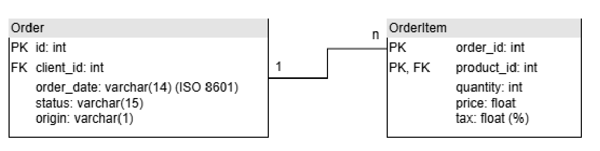
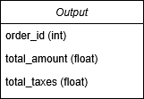

# Project_ETL

This OCaml project processes and filters order data from CSV files to generate a summarized report based on configurable criteria.

## Functionality
* **Data Parsing**: Reads and processes CSV files containing Order and OrderItem data.
* **Filtering**: Supports filtering orders by status (pending, complete, cancelled) and origin (P for physical, O for online).
* **Aggregation**: Computes:

    * total_amount: The total revenue of an order (sum of price * quantity for all items).

    * total_taxes: The total tax amount ((price * quantity) * tax for all items).

* **CSV Output**: Generates a summary file (out.csv) with order_id, total_amount, and total_taxes.

* This tool provides efficient and structured data processing for order tracking and financial reporting.

## Diagrams
### Input tables

### Output table

## Usage:
### 1. Release

* Download latest executable release
* Usage: <em>./project_etl_linux  <orders_csv> <items_csv> <output_csv> <status> <origin> </em>

### 2. Build
* Install [opam](https://opam.ocaml.org/doc/Install.html) and [dune](https://dune.build/install) 
* cd inside project folder
* <em>dune build</em>
* Usage: <em>dune exec project_etl  <orders_csv> <items_csv> <output_csv> <status> <origin> </em>
* Executable can be found in <em>_build/install/default/bin/</em>
* Example options can be found and run with *run_etl.sh*

### Options:
* status (Case sensitive): Pending|Complete|Canceled
* origin (Case sensitive): P|O
